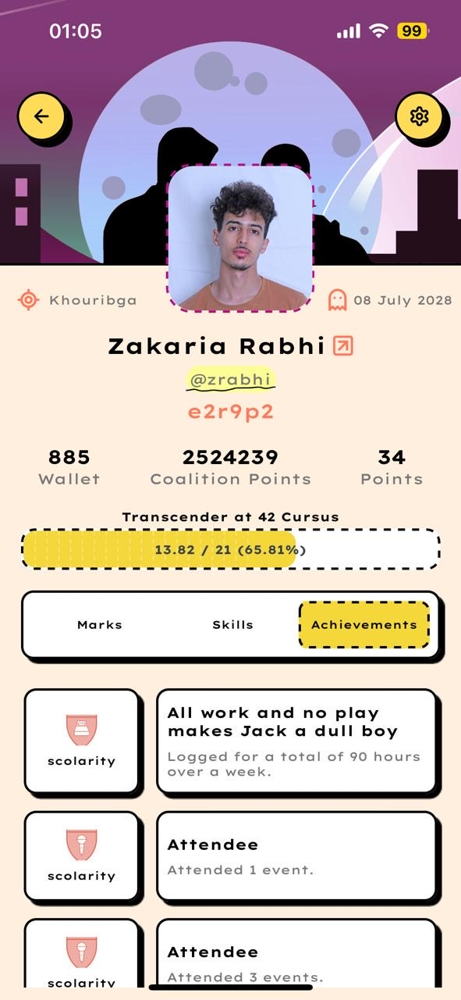

# 📱 42 Look Up

**42 Look Up** is a mobile application that uses the [42 API](https://api.intra.42.fr/apidoc) to fetch and display detailed information about users from the 42 Network. It includes profiles, project achievements, skills, and more.

---

## ✨ Features

- 🔐 42 OAuth login flow
- 👤 View user profiles and cursus
- 🏆 Display user achievements and finished/in-progress projects
- 📊 Skill chart rendering
- 🧪 Type-safe environment variable validation with `zod`
- 🚀 Built with React Native and Expo

## 📸 Screenshots
|       Login        |
|--------------------|
|  |

| Profile - Marks | Profile - Skills | Profile - Achievements |
|-----------------|------------------|-------------------------|
|  |  |  |

| Settings | Users List | Users List + Search |
|----------|------------|---------------------|
|  |  |  |

| Error View | Network Issue | Not Found |
|------------|----------------|-----------|
|  |  |  |


## ⚙️ Environment Variables

The project uses strict validation for environment variables via `zod`.

Create a `.env` file at the root of your project with the following structure:

```env
NAME=42-look-up
SCHEME=your-app-scheme
CLIENT_SECRET=your-client-secret
REDIRECT_URL=your-redirect-uri
CLIENT_UID=your-client-uid
FORTY_TWO_CDN_URL=Forty-two cdn
BUNDLE_ID=com.your.bundle.id
PACKAGE=com.your.package.name
API_URL=https://your.api.url
EXPO_ACCOUNT_OWNER=your-expo-username
EAS_PROJECT_ID=your-eas-project-id
